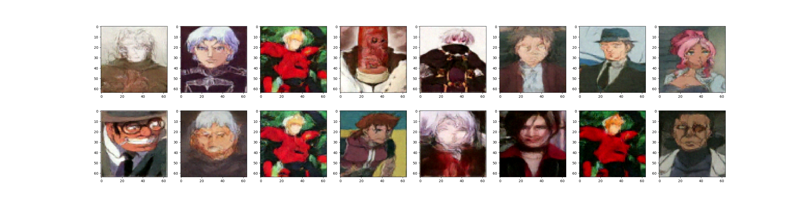
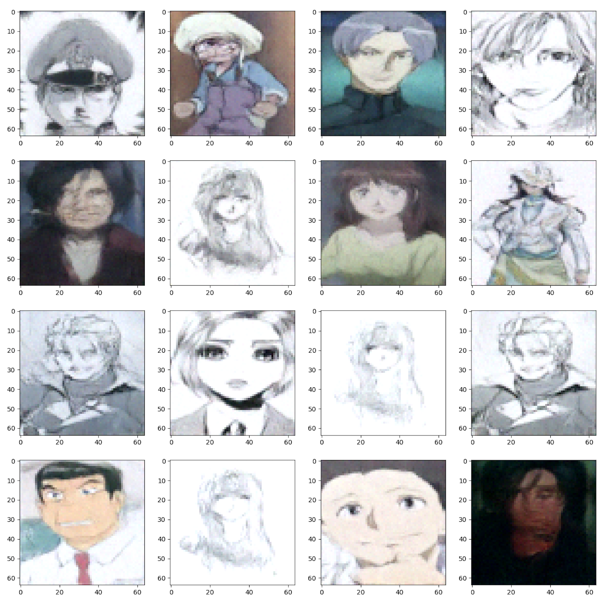
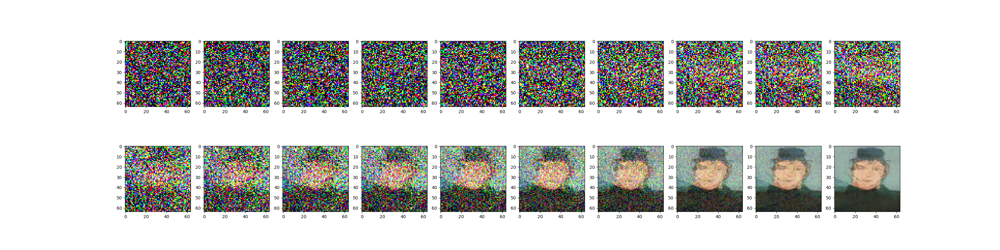
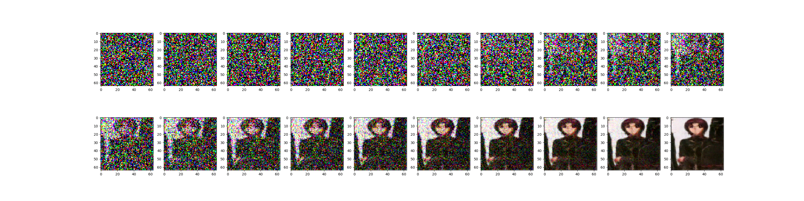
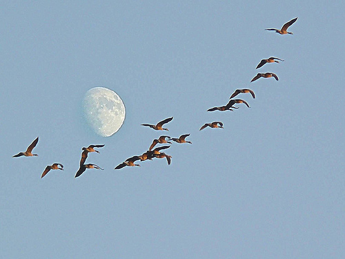
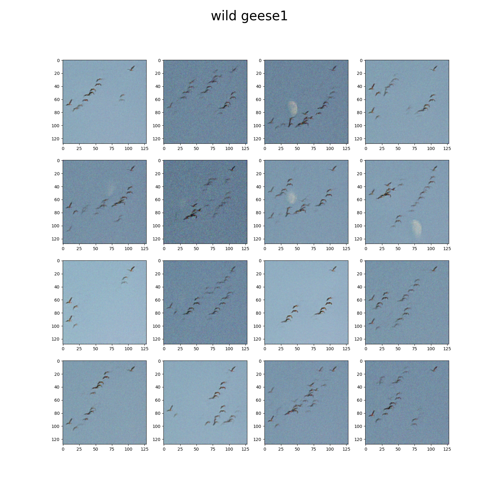
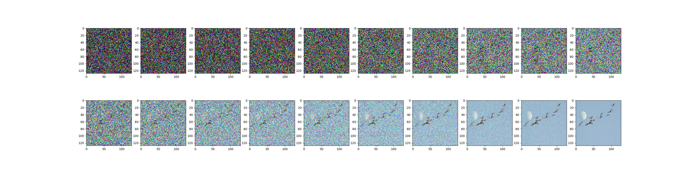
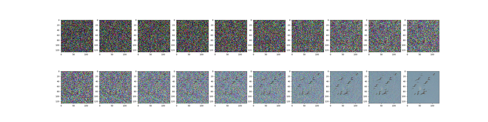

# Image generation based on Diffusion Module

## Overview

## Generation Results 

- Generated images of NetWork trained by **Anime Names and Images Dataset**
  
  <div align=center></div>
- Steps of generate an image by diffusion model
  
  

- Our sunet trained by Single Image 

We train our `model/sunet.py` by single image: 
  <div align=center></div>

There are results for Generated images, you can see even training with a single image produces images with different effects
  <div align=center></div>

You can see the Genrate steps for images:
  
  

## Prerequisites

- Linux/MacOS 
- Python3
- CPU or NVIDIA GPU

```shell
python3 train_single.py \
    --dataset ./data/single/ \
    --img_name geese.png \
    --epoch=32 \
    --image_size=128 \
    --b=32 \
    --load \
    --model_name geese.pth
```

```shell
python3 train_kaggle.py\
    --dataset ./data/ \
    --img_dir kaggle/ \
    --data_txt name.txt \
    --epoch=32 \
    --image_size=64 \
    --b=16 \
    --load \
    --model_name Gen8000.pth
```

## Datasets 

We use  [Anime Names and Images Dataset](https://www.kaggle.com/datasets/shanmukh05/anime-names-and-image-generation) by Kaggle to train our naive DDPM model.

We use single image online to train our Single Diffusion Model, you can see the image in `data/single/*.png`. 

Actually, you can use the datasets/images to train our models.

## Neural Network Structure

## Training the model

## Generate the Image

## Pretrained models
We supply our pretrained NetWork in ..., 
you can use these Networks to generate the images

## Reference 