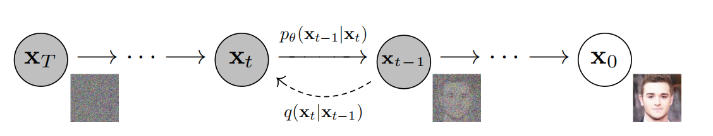
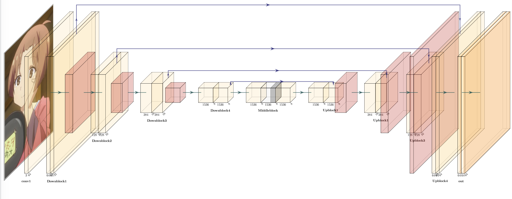

# Image generation based on Diffusion Module

## Overview

This is the repository for **ZJU 课程综合实践Ⅱ 2023**, the project we select is **Image generation based on Diffusion Module**, the implementation is based on **DDPM** and **DDIM** model, we use [Kaggle Dataset](https://www.kaggle.com/datasets/shanmukh05/anime-names-and-image-generation) to train our implementation of **UNet**, and it has achieved better results for generating images. 

We also simplify UNet by removing Attention Block , Middle Block and reducing the number of convolutional layers to train **single** image, it achieves interesting generation results different from UNet.

- DDPM:
 <div align=center>

- DDIM:
 <div align=center></div>
 
- Single Diffusion:
  <div align=center></div>
 


## File structure 

- model:
```
model
├── ddim.py
├── ddpm.py
├── sunet.py
└── unet.py
```

`ddpm.py`: the class for ddpm model, including processes such as denoising and adding noise and some other helper functions. 

`ddim.py`: Inherited from ddpm, implement the denoising process of ddim.


`unet.py`: the implementation of unet, We adapted our model based on the original [unet](https://arxiv.org/abs/1505.04597) and made some adjustments. 

`sunet.py`: a simplified implementation for unet, it doesn't use middle block、attention block and reduced neural network depth, it will be trained by **Single Diffusion Model**.

- dataset:
```
dataset
├── kaggle.py
└── single.py
```

`kaggle.py`: dataset for **Anime Names and Images Dataset**. 

`single.py`: dataset for Single Diffusion Model.


## Generation Results 

- Generated images of NetWork trained by **Anime Names and Images Dataset**
  
  <div align=center></div>
- Steps of generate an image by **DDPM** model
  
  

- Use **DDIM** to generate images:
  
  

- Our sunet trained by Single Image 

We train our `model/sunet.py` by single image: 
  <div align=center></div>

There are results for Generated images, you can see even training with a single image produces images with different effects
  <div align=center></div>

You can see the Genrate steps for images:
  
  

## Prerequisites

- Linux/MacOS 
- Python3
- CPU or NVIDIA GPU


## Datasets 

We use  [Anime Names and Images Dataset](https://www.kaggle.com/datasets/shanmukh05/anime-names-and-image-generation) by Kaggle to train our naive DDPM/DDIM model.

We use single image online to train our Single Diffusion Model, you can see the image in `data/single/*.png`. 

Actually, you can use the datasets/images to train our models.


## Training the model & Generate the images

- **Training the model:**

To train the model for **Kaggle Dataset**, execute the following command.

Since login permission is required to download the dataset, if you want to train 
[Kaggle Dataset](https://www.kaggle.com/datasets/shanmukh05/anime-names-and-image-generation), you should download it first, then named `./arhive/dataset/dataset/*.jpg` as `./kaggle/*.jpg` to replace the folder `./data/kaggle` and use `sh get_txt.sh` to get a new `name.txt`.

If you want to use the pre-trained network, you can use `--load`,else you can 
train a new network yourself.

```shell
python3 train_kaggle.py\
    --dataset ./data/ \
    --img_dir kaggle/ \
    --data_txt name.txt \
    --epoch=32 \
    --image_size=64 \
    --b=16 \
    --load \
    --model_name Gen8000.pth
```

To train the **Single Diffusion model** , execute the following command.

```shell
python3 train_single.py \
    --dataset ./data/single/ \
    --img_name geese.png \
    --epoch=32 \
    --image_size=128 \
    --b=32 \
    --load \
    --model_name geese.pth
```

- **Generate the images**:

To generate images trained by **Kaggle DataSet**, execute the following command.

The images will be generated by **ddpm** and **ddim**, you can set  `--ddim_steps`  for the steps of ddim.

```shell
python3 gen_kaggle.py\
    --dataset ./data/ \
    --img_dir kaggle/ \
    --data_txt name.txt \
    --image_size=64 \
    --load \
    --model_name Gen8000.pth \
    --gen_name gen \
    --ddim_steps=100
```


To generate images by **Single Diffusion model** , execute the following command.

```shell 
python3 gen_single.py \
    --dataset ./data/single/ \
    --img_name geese.png \
    --image_size=128 \
    --load \
    --model_name geese.pth


python3 gen_single.py \
    --dataset ./data/single/ \
    --img_name oil_paint.png \
    --image_size=128 \
    --load \
    --model_name oil.pth
```

## Pretrained models
We supply our pretrained NetWork in ..., 
you can use these Networks to generate the images

## Neural Network Structure

Our Neural Networks are based on UNet
 <div align=center></div>


## Reference 

1.DDPM:[https://arxiv.org/abs/2006.11239](https://arxiv.org/abs/2006.11239)

2.DDIM:[https://arxiv.org/abs/2010.02502](https://arxiv.org/abs/2010.02502)

3.Single Diffusion:[https://github.com/WeilunWang/SinDiffusion](https://github.com/WeilunWang/SinDiffusion)

4.DDPM PyTorch implementation:[https://github.com/labmlai/annotated_deep_learning_paper_implementations/tree/master/labml_nn/diffusion/ddpm](https://github.com/labmlai/annotated_deep_learning_paper_implementations/tree/master/labml_nn/diffusion/ddpm)

